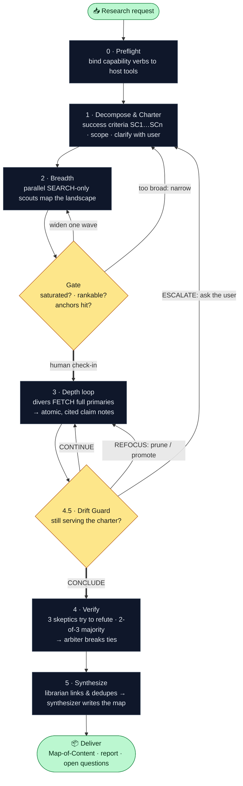

<div align="center">

# 🤿 Deep Ass Research

**Research like a paranoid PhD, not a search bar.**

<em>Maps a topic wide, commits to depth on purpose, tries to <strong>refute its own findings</strong>, and leaves you a backlinked, primary-sourced knowledge vault — in any AI coding agent.</em>

<p>
  
  
  
  
  
</p>

<a href="#-before--after">Before / After</a> •
<a href="#-how-it-works">How it works</a> •
<a href="#-install">Install</a> •
<a href="#-what-you-get">What you get</a> •
<a href="INSTALL.md">Full install guide</a>

</div>

---

Most "research" an agent does is one search, three skimmed snippets, and a confident paragraph that may or may not be true. **DAR** runs the loop a careful human would: cast wide, decide where to go deep, read the **primary** source (not the thread about it), send skeptics to **disprove** every load-bearing claim, and write it all into an Obsidian vault where every sentence traces to a source you can re-open.

It's host-agnostic: the methodology is plain markdown (`core/`), and thin adapters bind it to Claude Code, Cursor, opencode, or anything that reads `AGENTS.md`.

## 🪞 Before / After

You ask: *"How much revenue does Perplexity make and what's their strategy?"*

<table>
<tr>
<td width="50%" valign="top">

### 🔍 Normal agent

> "Perplexity makes around $100M and is positioned as an AI answer engine competing with Google."

One search. No source. No idea if it's current, self-reported, or made up.

</td>
<td width="50%" valign="top">

### 🤿 DAR

> A vault: a claim note **S-001** — *"~$100M ARR by mid-2025"* — with the **verbatim quote**, the **primary** URL, `status: verified`, an independent corroboration, and a caveat that it's *self-reported run-rate*. Linked to `[[Perplexity AI]]`, `[[Aravind Srinivas]]` (with sourced beliefs from his actual posts), and a thesis thread — plus an honest list of what's still unproven.

</td>
</tr>
</table>

**Same question. One is a vibe. The other is a defensible, navigable answer you can audit.**

## 🧭 How it works

DAR has two halves that share one spine — the **charter** (what we're actually trying to answer). A **gate** stops it from going deep too early; a **drift guard** stops it from wandering once it's deep. The charter is a *compass, not a cage*: useful tangents get promoted, dead ones pruned.



The principles behind each step (why they exist) — straight out of how good researchers actually work:

- **Range before depth.** Cheap, disposable `SEARCH`-only scouts first; expensive `FETCH` only on threads that survive the gate.
- **Read the primary, not the summary.** Divers fetch the full source (incl. appendices & limitations) into `raw/`; a claim sourced only to a summary is quarantined.
- **Don't fool yourself.** Skeptics are scored to *disprove* claims; disconfirming evidence is written **into** the note; contradictions are downgraded, never deleted.
- **Synthesis is the contribution.** The deliverable is a navigable `_MOC.md` + `[[wikilink]]` graph + a report answering each criterion — not a wall of text.

## 📦 Install

> Optional but recommended: set whichever API keys you have (`TAVILY_API_KEY`, `EXA_API_KEY`, …). DAR runs on a host's built-in web tools and is *maximized* by Tavily / Exa / TinyFish / Context7 / Ref — see [`core/PREREQUISITES.md`](core/PREREQUISITES.md). Missing tools degrade loudly, never silently.

### Claude Code — plugin (one command, auto-wires MCP)

```
/plugin marketplace add Kaos599/Deep-Ass-Research
/plugin install deep-ass-research@dar-marketplace
```

Registers the seven `dar-*` role subagents, the `/deep-ass-research:dar` command, and the prerequisite MCP servers.

### Claude Code — skill (zero assembly)

```bash
git clone https://github.com/Kaos599/Deep-Ass-Research.git
ln -s "$(pwd)/Deep-Ass-Research" ~/.claude/skills/deep-ass-research
```

Then just ask for *"deep research on X"* or run `/deep-ass-research`.

### Cursor

```bash
cp adapters/cursor/deep-ass-research.mdc .cursor/rules/
cp adapters/cursor/dar.command.md        .cursor/commands/dar.md
```

### opencode

```bash
cp adapters/opencode/deep-ass-research.md ~/.config/opencode/agent/
# then merge adapters/opencode/opencode.json (MCP servers + dar-* subagents)
```

### Any other agent (Codex, Aider, Gemini CLI, custom)

Load [`adapters/generic/AGENTS.md`](adapters/generic/AGENTS.md), or paste [`adapters/generic/SYSTEM_PROMPT.md`](adapters/generic/SYSTEM_PROMPT.md) into the system prompt. No sub-agents? DAR runs the roles sequentially in-context — same method.

Full per-host details: **[INSTALL.md](INSTALL.md)**.

## 🧰 What you get

A self-contained Obsidian vault at `~/research/dar/<date>-<topic>-<id>/` (override with `DAR_VAULT_ROOT`):

| In the vault | What it is |
|---|---|
| `sources/S-NNN-*.md` | one **atomic claim** per note — verbatim quote, primary URL, `status` + `confidence`, links |
| `entities/*.md` | companies / people / concepts (people carry sourced, quoted beliefs) |
| `threads/T-*.md` | synthesis notes with a stated thesis, a reasoning chain of `[[links]]`, and counter-evidence |
| `raw/` | the cached primary sources — the provenance floor, re-openable forever |
| `_verify-log.md` | every load-bearing claim's verdict + dissent |
| `_MOC.md` + `99-report.md` | the front-door map and the report answering each success criterion |

Run by seven focused roles you can spawn in parallel:

| Phase | Roles |
|---|---|
| Breadth | `scout` (cheap, wide, search-only) |
| Depth | `deep-diver` (reads full primaries) |
| Verify | `skeptic` ×3 → `arbiter` |
| Synthesize | `librarian` (links/dedupe) → `synthesizer` (the deliverable) |
| Steering | `relevance-monitor` (the drift guard) |

<details>
<summary><strong>Repo layout</strong></summary>

```
deep-ass-research/
├── SKILL.md                  # Claude Code entry (drop-in skill)
├── core/                     # PORTABLE methodology — names no host tool
│   ├── capabilities.md  PREREQUISITES.md  methodology.md  orchestration.md
│   ├── vault-layout.md  note-schemas.md  provenance.md
│   ├── roles/   scout · deep-diver · skeptic · arbiter · librarian · synthesizer · relevance-monitor
│   └── modes/   academic · gtm · technical · market
├── adapters/
│   ├── generic/    AGENTS.md + SYSTEM_PROMPT.md
│   ├── claude-code/ dar-pipeline.workflow.js + plugin/   (pre-assembled, installable)
│   ├── cursor/     deep-ass-research.mdc + dar.command.md
│   └── opencode/   deep-ass-research.md + opencode.json + subagents/
└── .claude-plugin/marketplace.json   # makes the repo a one-command plugin
```

**Start at [`core/orchestration.md`](core/orchestration.md)** — the runbook every adapter points to.
</details>

## 🎛️ Research modes

DAR picks a playbook by topic, each with its own decomposition and source strategy:

| Mode | For | Move |
|---|---|---|
| **academic** | papers / literature | read methods + appendix + limitations; build a citation graph |
| **gtm** | a company, its people & beliefs | company → people → their actual posts → coherent narrative chain |
| **technical** | "how does X work", tool choices | primary docs (Context7/Ref); A-vs-B-vs-C with a recommendation |
| **market** | competitive / sector intel | players → positioning → pricing/funding/trend signals → matrix |

---

<div align="center">
<sub>Built to be portable, auditable, and hard to fool. Read the primary. Write everything down. Don't kid yourself.</sub>
</div>
